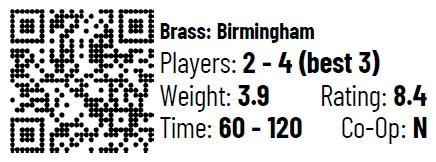

# Ork BGG

Ork BGG is a simple web app to catalog, browse, and search your board game
collection. It pulls data from [Board Game Geek](http://boardgamegeek.com) and
caches it in a local SQLite database for quick searches.

## Installation

```sh
git clone https://github.com/AlexHowansky/ork-bgg.git
composer install
```

Run a development server with `composer go` or point your webserver's document
root to the `public` directory.

## Data

Run `bin/sync <bgg username>` to pull/sync your collection from BGG. The
username is case sensitive. Any game in your "Own" collection on BGG will be
copied into the local database for the indicated user. As the BGG API has a
fairly restrictive usage throttle, this may take some time.


## Labels



Ork BGG can create box labels to summarize important game characteristics in a
consistent place and format. These are designed to fit on standard Avery 5160
address label sheets, and include a QR code to the BoardGameGeek detail page
for that game. When printing, make sure to disable any fit-to-page feature that
your system offers. Print the document at actual size or 100% zoom. To generate
a PDF of labels, run `bin/labels <bgg username> [<pattern>] [<limit>] [<skip>]`
where:

`<pattern>` is an optional slash-delimited regular expression or a case
insensitive substring to match the name on. Leave unspecified, use an empty
string `""`, or use a catch-all regex `/./` to include all titles.

`<limit>` is an optional value to limit the number of labels created, with 30
fitting on one page. Leave unspecified or use `0` to set no limit.

`<skip>` is an optionl value representing the number of label spaces to skip.
This is useful if you've got a label sheet with some labels already used. These
are counted starting from the upper left, going left to right then top to
bottom. So, a `<skip>` value of 4 will result in the first label being located
in the middle column of the second row.
